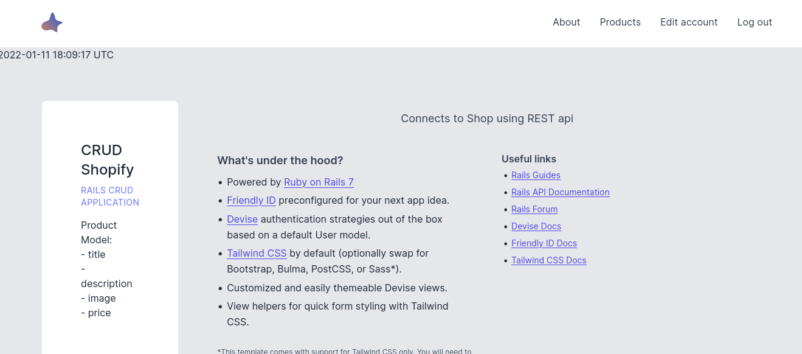
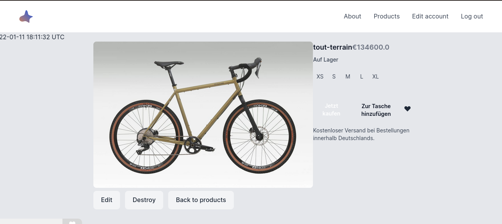
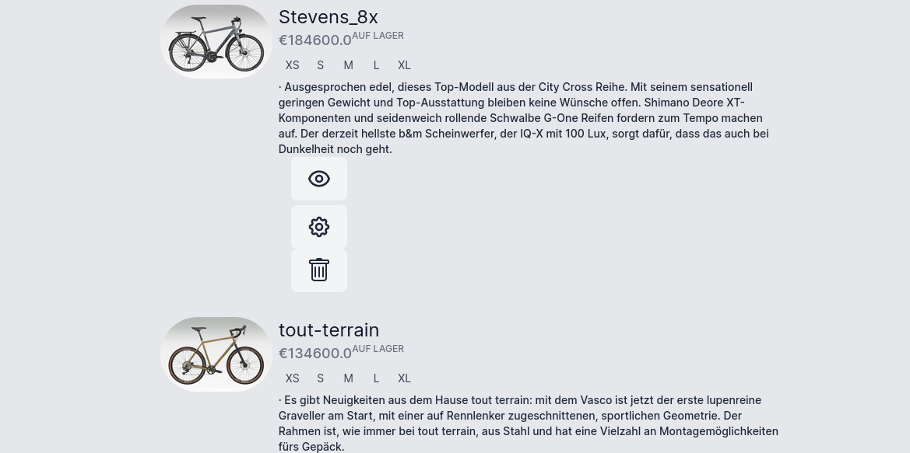
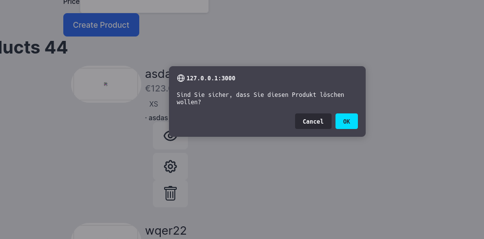
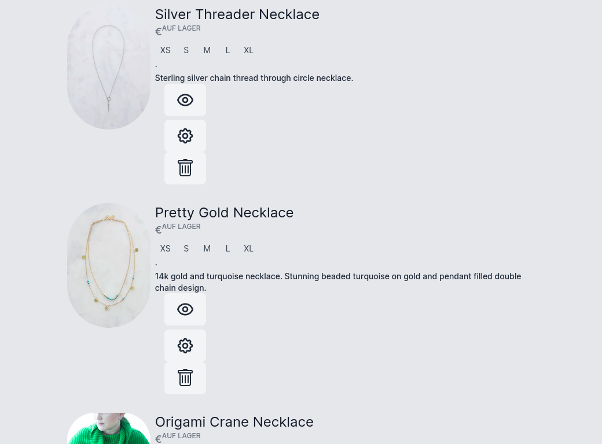
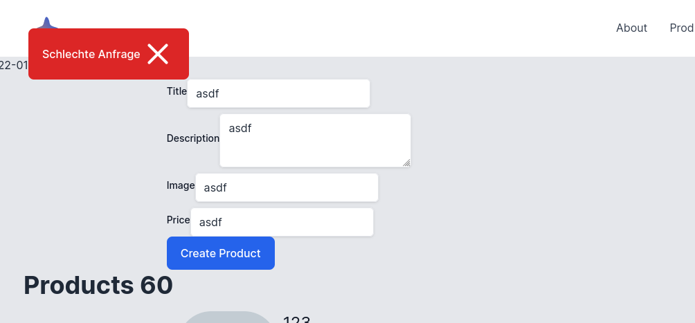
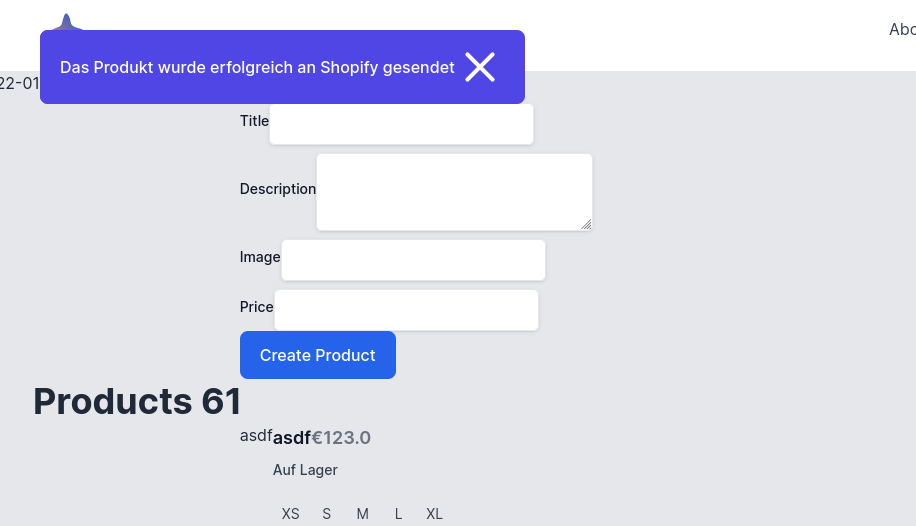

## Shopify Ruby 3.1.0 Rails 7 CRUD Tailwind Turbo Sync Starter

Syncs Load DB Table of Products Title, Description, Image, Price with Shopify.

### RestClient instead of shopfiy_api

- shopify-cli does not not work either.
- shopfiy_api is broken in this version of Rails 7 as of writing of this code
- 2022 - Jan - 12 "NoMethodError: undefined method `api_version=' for ShopifyAPI::Base:Class ""

### What's under the hood?

- Powered by [Ruby on Rails 7](https://rubyonrails.org)
- [RestClient](https://github.com/rest-client/rest-client) to call shopify using rest instead of shopify_api that is broken.
- [Friendly ID](https://github.com/norman/friendly_id) preconfigured for your next app idea.
- [Devise](https://github.com/heartcombo/devise) authentication strategies out of the box based on a default User model.
- [Tailwind CSS](https://tailwindcss.com) by default (optionally swap for Bootstrap, Bulma, PostCSS, or Sass*).
- Customized and easily themeable Devise views.
- View helpers for quick form styling with Tailwind CSS.


### Install . How to use

```bash
    rbenv install 3.1.0 
    rbenv local 3.1.0
    bundle
    rbenv rehash

    gem install shopify_cli
    rbenv rehash
    shopify login --store=gmbh-teststore


    
    cp .env.sample .env
    nano .env
    # add all the values for your store 


    rails s
    rm db/development.sqlite3 db/test.sqlite3 ; rake db:create db:migrate db:seed
    # browser opens and asks for confirmation of first user
    # control c
    
    # do intial sync download into load table 
    rake products:get


    rails s

```
### Screenshots









